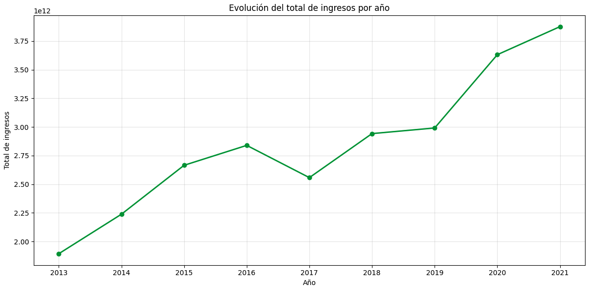
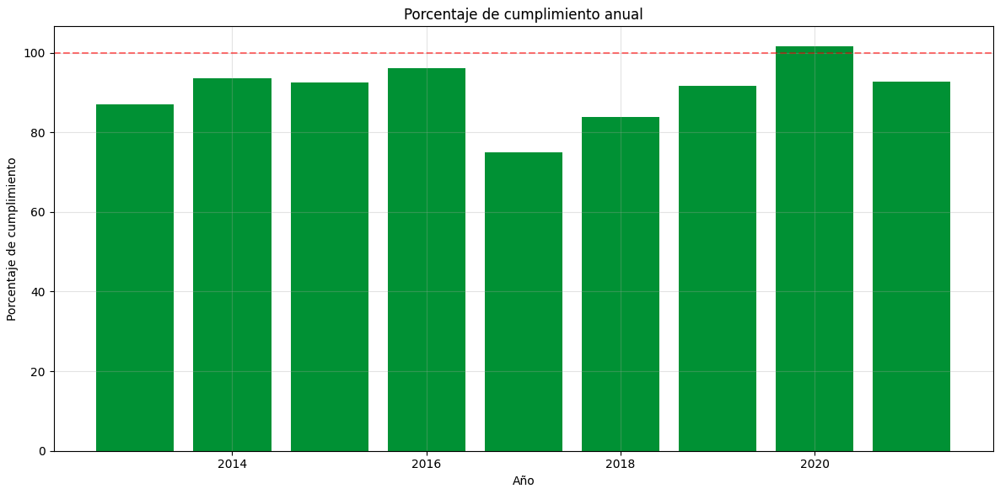
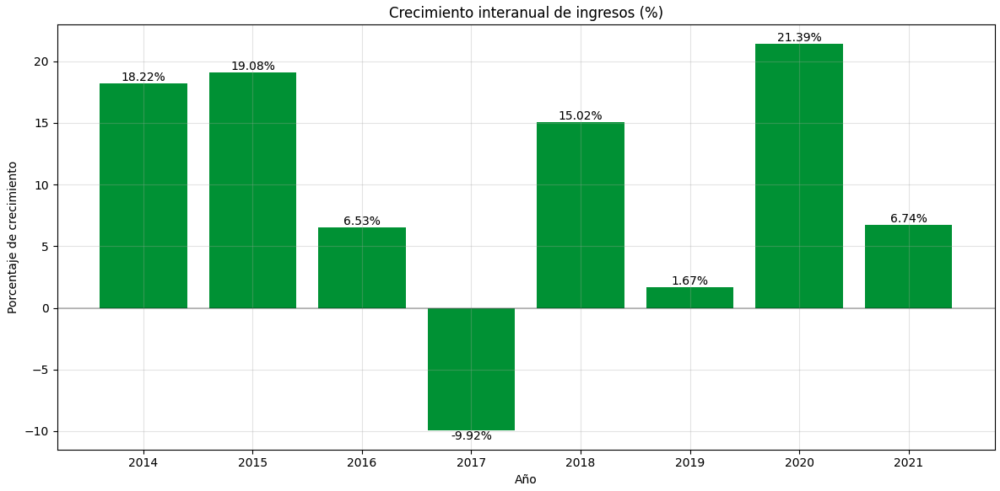

# Proyecto2-EDA-Python

**Descripción del Proyecto** 

El proyecto consiste en un análisis descriptivo de los ingresos gubernamentales de Brasil, evaluando las diferentes categorías económicas, cumplimiento de previsiones y tendencias a lo largo del tiempo.

**Estructura del Proyecto** 

    ├── ejercicio/1-preparacio-datos.ipynb        # Limpieza y preparación datos
    ├── ejercicio/2-EDA.ipynb                     # Análisis exploratorio de datos
    ├── README.md                                 # Descripción del proyecto
    ├── enunciado.md                              # Enunciado del ejercicio
    ├── Imagenes                                  # Imágenes usadas en el README.md 
    ├── Datos/                                    # Carpeta con los datos
    ├── src/                                      # Carpeta con archivo auxiliar
    ├── venv/                                     # Entorno virtual 

**Instalación y Requisitos** 

1. Clonar el repositorio

```bash
git clone [URL_del_repositorio]
cd [nombre_del_rpoyecto]
```

2. Crear y activar el entorno virtual
```bash 
python -m venv venv
# Windows:
venv\Scripts\activate
# Unix/MacOS:
source venv/bin/activate
```

3. Instalar las dependencias
```bash 
pip install -r requirements.txt
#Si diese problemas, instalar 1 por 1
```

**Resumen y resultados** 

El análisis abarca datos de ingresos gubernamentales brasileños entre 2013 y 2021, proporcionando insights sobre la gestión presupuestaria y el cumplimiento de objetivos.

*** Big numbers *** 

Evolución Total de Ingresos:
- 2013: 1.89T
- 2021: 3.88T
- Crecimiento acumulado: Aproximadamente 100%



Cumplimiento de Previsiones:
- Mayor cumplimiento: 101.52% (2020)
- Menor cumplimiento: 74.92% (2017)
- Promedio: ~90%



Crecimiento inter-anual:
- 2014   18.22
- 2015   19.08
- 2016    6.53
- 2017   -9.92
- 2018   15.02
- 2019    1.67
- 2020   21.39
- 2021    6.74



Tendencias Generales:
- Crecimiento consistente excepto en 2017
- Mayor estabilidad en categorías no intra-presupuestarias
- Planificación generalmente realista pero conservadora

Cambios Estructurales:
- 2017-2018: Punto de inflexión importante
- 2020: Año excepcional en cumplimiento

**Conclusiones** 

El análisis revela un sistema presupuestario generalmente efectivo con buena capacidad de recuperación. Se observa una tendencia hacia mayor estabilidad en categorías regulares, aunque con necesidad de atención a la volatilidad en recaudación.

**Links** 

Repositorio https://github.com/miguelow/Proyecto2-EDA-Python

Linkedin https://www.linkedin.com/in/miguel-ortega-ward/
